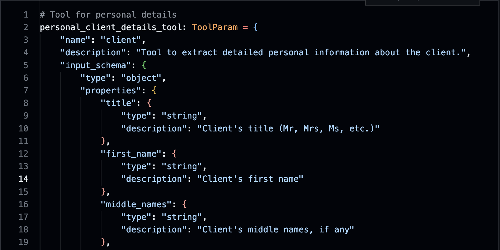
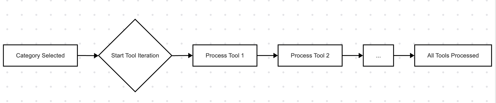
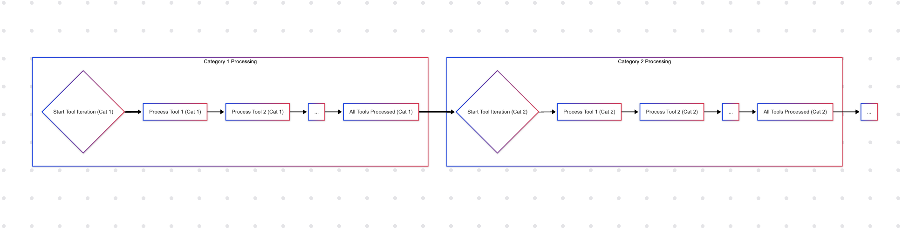
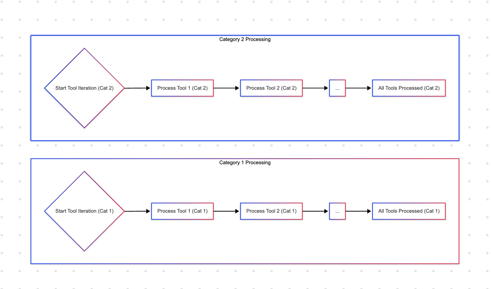
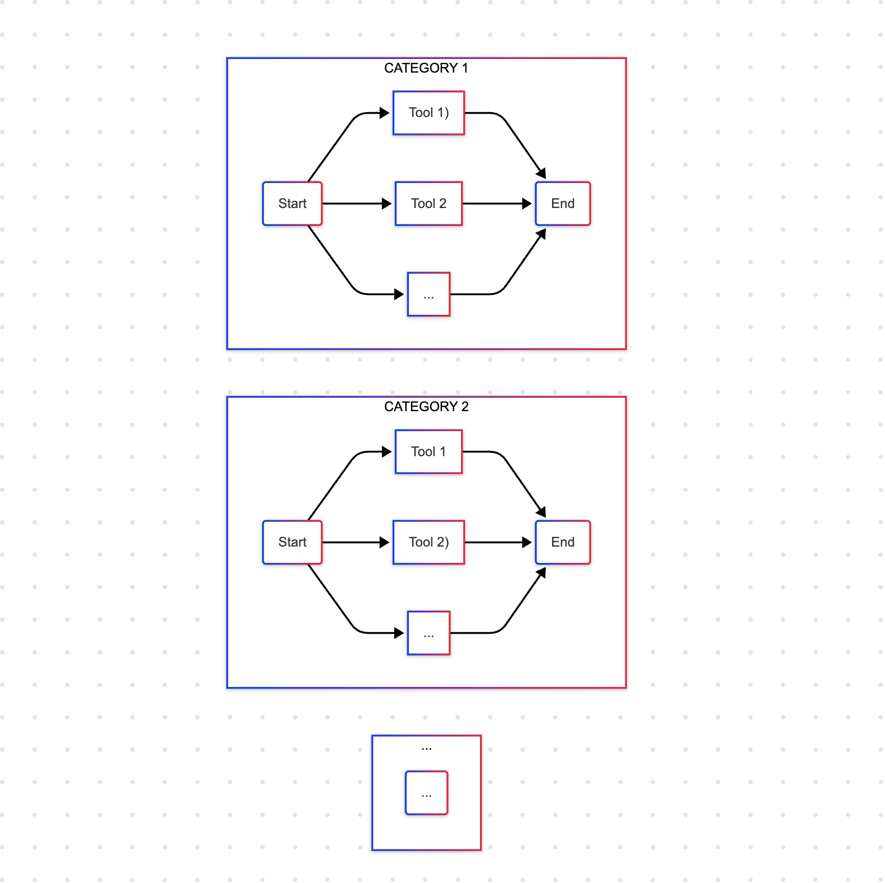
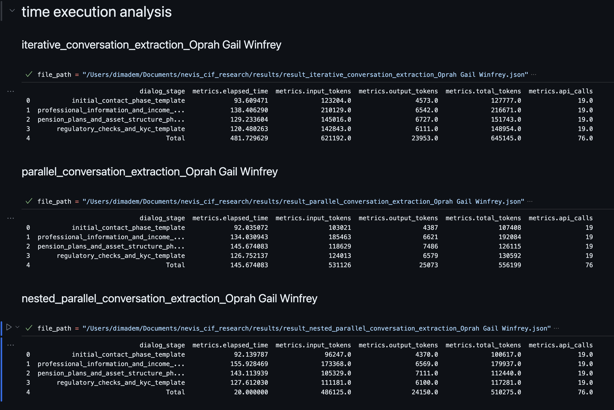

# Automating Customer Information Form (CIF) Completion in Wealth Management using LLMs
Researcher: Dmitry Demirkylych

## TASK
Develop a pipeline based on Large Language Models (LLMs) to extract client responses from call transcripts in the wealth management sector. The extracted data must be presented in JSON format.

### Objectives:
- Create an LLM-based solution for extracting structured data from call transcripts.
- Evaluate the performance of the proposed solution using synthetic data for assessment.
- Propose improvements for the solution and evaluate their impact on performance metrics.

## Preliminary Research
An initial qualitative research phase was conducted to understand the context, structure, and specifics of dialogues between financial advisors and clients.

Semi-structured interviews were conducted with experts familiar with the client onboarding process:
- Principal Business Transformation Consultant (SAP)
- Associate Investment Advisor (BMO Nesbitt Burns)

### Insights:
- Dialogue Structure: The data collection process often follows standard procedures and includes typical questions.
- Data Availability: Information about some clients may partially exist in the company's systems, and the dialogue might involve verifying or updating it.
- Operational Efficiency: The speed of information processing and document preparation is a significant factor. Reducing manual data handling time allows advisors to move faster to subsequent interaction stages and aligns with the "Always be Closing" business principle, potentially impacting conversion and client satisfaction.

## Synthetic Data Generation
[JypiterNotebook](notebooks/generating_synthetic_dialogue.ipynb)

Due to the lack of publicly available actual call transcripts, a synthetic dataset was generated.
- Form structure: references/cif_result_reference.json
- LLM: claude-3-sonnet-latest from Anthropic. Claude models work effectively with structured prompts, including XML tags.
- system_prompt structure:
    - <persona_1> (Advisor): Static persona -> (James Carter, Senior Wealth Advisor, Nevis).
    - <persona_2> (Client): Dynamic description with variable fields (Name, Background, Financial Situation, Personality, Communication Style, Objectives), based on profiles modeled after public figures (Elon Musk, Oprah Winfrey, Steve Jobs, Warren Buffett) to introduce diversity.
    - <dialogue_instructions>: Context and topics for current phase, formatting rules.
- Generation Process: The conversation was generated iteratively, simulating the Advisor-Client interaction managed by the LLM with corresponding prompts. Dialogues are structured into phases with 60 exchanges in each phase.

It's important to understand the nature of this synthetic dataset. A key feature is that it generally presents clear dialogue where the LLM, acting as the client or advisor, tries to directly answer the questions asked, following the instructions given. This contrasts with real-world conversations, which can be quite different. In reality, speakers might respond unclearly, use filler sounds (like "um" or "uh"), avoid directly answering a question, or give inconsistent replies. 

If real conversations were recorded and transcribed automatically, there could also be transcription errors – text that isn't quite correct. A human listening might understand the intended meaning from context, but an AI model might struggle to process these inaccuracies or ambiguities correctly. Real conversations might also contain factual errors that would need careful checking. These factors mean that real-world data can be messy, and models trained or evaluated solely on clean, synthetic data might perform differently when faced with the complexities of actual human interaction.

## Data Extraction Pipeline
[JypiterNotebook](notebooks/parsing_cif.ipynb)

```
Raw Transcript → Pre-processing → Structured Information Extraction → Post-processing → CIF Completion.
```

- Pre-processing: It is assumed the transcript is already segmented by role (Advisor, Client).
- Structured Information Extraction: LLM call with "tool calling".
    
    

    - Tools: Groups of CIF fields are defined as "tools" with parameter descriptions.
    - Agentic Patterns: Approaches from Anthropic's agentic systems engineering and cookbook are used to manage the process:
      - Routing: Dynamically selects specialized LLM paths based on input characteristics.
      - Prompt-Chaining: Decomposes a task into sequential subtasks, where each step builds on previous results.
      - Parallelization: Distributes independent subtasks across multiple LLMs for concurrent processing.
    - Extraction strategies: Four strategies combining agentic patterns were considered:
      - **iterative_extract_category_data**: Routing + Prompt Chaining per category.
        
        

        - Suitable for targeted extraction of specific data types. Can be used for processing completed conversations (batch processing).
      - **iterative_conversation_extraction**: Prompt Chaining across all categories sequentially.

        

        - Suitable for comprehensive processing of the entire dialogue after its completion, when the order of data extraction is not critical.
      - **parallel_conversation_extraction**: Parallelization by category + Prompt Chaining within categories.
        
        

        - Potentially speeds up dialogue processing compared to sequential methods. Can be used for near real-time processing, allowing the interface to display populated CIF sections as they become ready.
      - nested_parallel_conversation_extraction: Parallelization by category and tool.
        
        

        - Offers the greatest potential for reducing processing time, critical for real-time scenarios. This could allow the CIF form to be updated almost instantly (up to 20 seconds).

- Post-processing (_alpha): An initial version has been implemented for aggregating (merging) data extracted by different tools and in different phases of the dialogue into a single object.
  
## Evaluation
[JypiterNotebook](notebooks/analytics.ipynb)

### Reports
All reports presented starting point for evaluation workflow.
- unknown_form_keys - if form contain "<UNKNOWN>" value
- total_form_keys - total fields presented in the form
- completion_rate - proportion of form fields that have been completed
- text_length - amount of characters in file
- is_valid_json - if file formated corretly

#### Oprah Gail Winfrey
[report_conversation_extraction_Oprah Gail Winfrey](reports/report_conversation_extraction_Oprah%20Gail%20Winfrey.html)

compared three extraction workflows. 
- iterative_conversation_extraction
- parallel_conversation_extraction
- nested_parallel_conversation_extraction

#### Warren Edward Buffet
[report_conversation_extraction_Warren Edward Buffett](reports/report_conversation_extraction_Warren%20Edward%20Buffett.html)

compared three extraction workflows. 
- iterative_conversation_extraction
- parallel_conversation_extraction
- nested_parallel_conversation_extraction

#### Elon Reeve Musk
[report_10_iterative_conversation_extraction_Elon Reeve Musk](reports/report_10_iterative_conversation_extraction_Elon%20Reeve%20Musk.html)

compared ten forms from iterative extraction workflow from 10 conversations with Elon Musk. 


### Execution analysis



## Conclusion

The proposed solution automatically extracts structured information from conversations and organizes it into clean, usable JSON files. This ensures the data is consistent and ready for use by other systems.

### Benefits
- Saves Time: By automating data extraction, the system reduces the time financial advisors spend on manual tasks after calls (ACW - After-Call Work), potentially lowering Average Handling Time (AHT).
- Improves Call Quality & Completeness: Advanced techniques allow for near real-time processing, enabling features like automatically filling forms during calls and highlighting missed fields, which can improve First Call Resolution (FCR).


### Current Performance
Using the synthetic data we generated, the system successfully identifies all required information categories and accurately fills 95% of the fields with data extracted from conversations. And it could be processed in up to 20 seconds.

### Potential
These initial results show potential to save time and effort compared to manual data entry. While precise accuracy measurement is pending, the current findings confirm our approach **works well for extracting structured information**.

## Next Steps
To build on this potential, next steps focus on measurement, optimization, and real-world values:

### Measure Extraction Quality
- Goal: Measure how well the system retrieves information.
- How? I need data to compare against (a "ground truth").
    - Ideal: Get real call transcripts paired with the corresponding forms filled out manually by advisors.
    - Alternative: Generate improved synthetic data. This involves creating a target form first, then generating a conversation specifically designed to provide the information needed for that form.
- Evaluation:
    - Run extraction workflows
    - Compare the generated form against the referenced form.
    - And then calculate metrics like the F1-score to assess performance.

### Measure Real-World Impact (Requires Real Data / Pilot Project)
- Goal: Quantify the business benefits once the system is tested with real calls.
- How? Track key operational metrics:
    - Time Savings: Measure the reduction in After-Call Work (ACW) and Average Handling Time (AHT) achieved by the system compared to manual processes.
    - Accuracy & Corrections: Compare the rate of errors or missing information from the AI system against typical rates for manual data entry.
    - Call Resolution: Monitor the First Call Resolution (FCR) rate to see if improved form completeness leads to fewer follow-up calls.

### Optimize the Workflow
- Goal: Improve efficiency (cost/speed) and the quality of the final output.
- How? Сut all the excess:
    - Token Optimization: Add a pre-check step to exclude irrelevant categories before sending it to the extraction workflow.
    - Prompt Caching: Use Prompt Caching to reduce processing time and API costs.
    - Smart Merging: Create an agentic workflow to combine outputs from the extraction workflow. To resolve conflicts like multiple potential values for one field.

### Integrate Compliance
- Goal: Ensure the system operates within regulatory guidelines.
- How? Update the instructions (prompts) given to the AI tools/Post-processing to explicitly include compliance with GDPR or GLBA.

## References
- Anthropic Documentation. Use XML tags to structure your prompts
  - https://docs.anthropic.com/en/docs/build-with-claude/prompt-engineering/use-xml-tags
- Anthropic Engineering. Building effective agents.
  - https://www.anthropic.com/engineering/building-effective-agents
- Anthropic Cookbook. Agentic Workflows.
  - https://github.com/anthropics/anthropic-cookbook/blob/main/patterns/agents/basic_workflows.ipynb
- Anthropic Documentation. Prompt caching
  - https://docs.anthropic.com/en/docs/build-with-claude/prompt-caching

